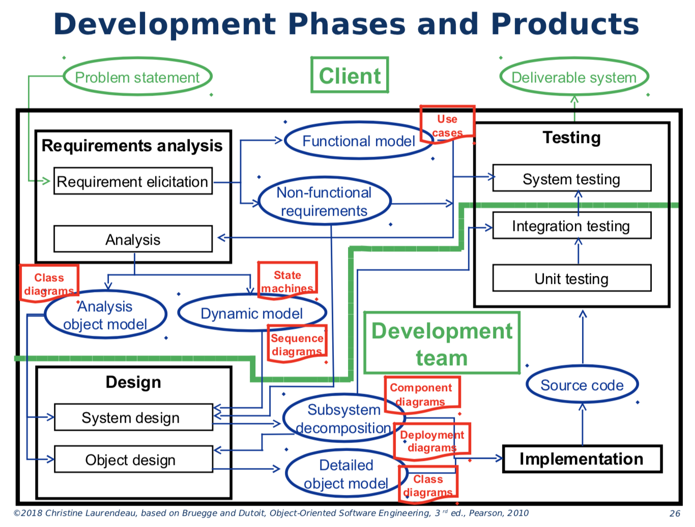
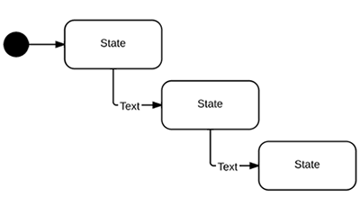
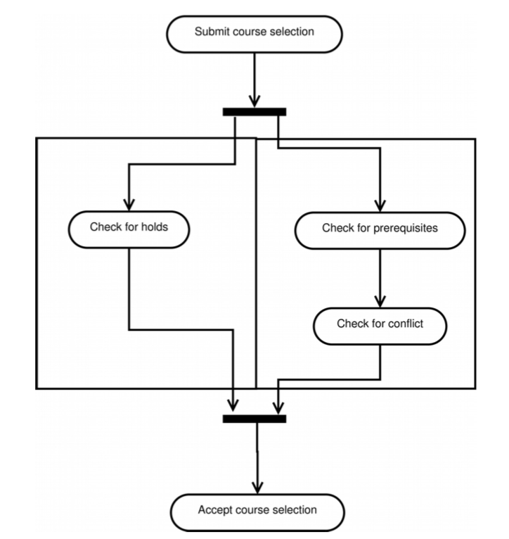
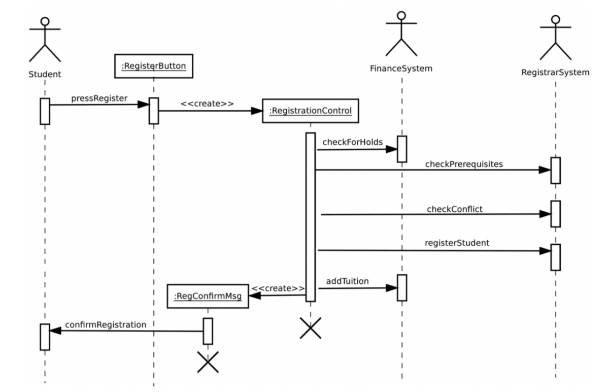

# Section 1: Introduction to Software Engineering

# Other Sections

Section 1: [Introduction to Software Engineering](Section%201.md) 
Section 2: [Requirement Analysis](Section%202.md) 
Section 3: [High-Level System Design](Section%203.md) 

# Section 1.1: Overview

**Software Engineering:**
- a problem solving methodology to implement a task

**System:**
- a set of components that work together to accomplish a task

**Process:**
- recipe, a set of instructions
- use a **reliable / modifiable** process to create reliable code

## The Plan
One software engineering process that has two components:
- technical
- management

**Technical Aspects:**
- **understanding the problem**
  - ask the client
  - do research
  - etc.
- to figure out the optimal solution based on design constraints / requirements

**Management Aspects:**
- keeping things on track
- **planning for change**
  - requirements may change at any time

## Technical Aspects

**Application Domain:**
- parts of the real world that are relevent to the problem
- client is the expert of this

**Solution Domain:**
- parts that make up the solution...
- we are the experts of this

**Building Models:**
- build models of the code to see how things would work
- like how buildings and airplanes models are built for **testing / feasibility** before the actual one is built

> - **How do we model the solution domain?**
>   - find a solution to the problem
>   - identify objects required to model the solution
>   - write the code
>   - make sure it works as expected
> - **What activities are involved?**
>   - high-level system design
>   - detailed object design
>   - implementation
>   - testing
> - **How do we model the application domain?**
>   - describe the problem to be solved
>   - describe the system requirements
>   - identify objects required to model the requirements
> - **What activities are involved?**
>   - requirements elicitation
>   - analysis

## Management Aspects

> **Communication tools:** notations, tools, programming conventions 
> **Configuration management:** version control 
> **Rationale management:** why did who make what decision when and how 
> **Software development processes:** sequential, iterative, Agile

## Software Development Phases

> - **Requirements analysis**
>   - requirements elicitation
>   - analysis
> - **Design**
>   - high-level system design
>   - detailed object design
> - **Implementation**
> - **Testing**
>   - unit testing, integration testing
>   - system testing
> - **Deployment and maintenance**

## Software Development Products

**Work Product:** unit of work (e.g. diagrams / source code / etc)
- _functional model:_ system from user's point of view
- _dynamic model:_ internal system behaviour from user's point of view
- _object model:_ system objects / attributes / operations

**Deliverable:** work product delivered to client

## Development Phases

# Section 1.2: Team Project

# Project Requirements

- must be implemented in C++
- must have a UI
  - wither Qt or commandline (fewer marks)

## Team Organization

Collaborating with others is critical in any job, and if possible, the people you work must be chosen wisely.

## People Management

Four main factors in managing people:
- **consistency:** everyone on the team treated fairly + equally
  - equally ≠ identically
- **respect:** appreciate everyone's different skills and contributions
- **inclusion:** make sure everyone's ideas are heard
- **honesty:** be honest about your work / skills
  - truth will always come out
  - better if you are the one to break bad news...

**Teams** should have a purpose for existing (i.e. a goal) and should actively work cohesively. It is not simply a group of individuals.

- **balanced skill-set:** everyone should be able to work with all the tools used by the team
- **member roles are assigned:** consistent members' preferences and skill-sets
- **information is shared:** continuous integration and communication
- **honest for reporting work done:** team members should trust but verify each other's progress

### Qualities of a Good Leader

The team leader ensures **things happen**.
- they organize work for the team
- makes sure the team has all the resources it needs
- _encourages, motivates, listens, fixes_

## Informal Team Roles (Primes)

- **documentation** documents formatting + content
- **requirements** document all requirements are documented (traceable)
- **architecture / design** complete and optimal design
- **testing** features match the requirements
- **configuration** package deliverable code

# Section 1.3: UML Notation

## Unified Modelling Language

**UML** is **a tool** for expressing **system models**:
- **functional models**
  - case diagrams
- **dynamic models**
  - state diagrams
  - sequence diagrams
  - activity diagrams
- **object models**
  - class diagrams

It is used to **facilitate communication** between:
- clients + development team
- within development team

## Case Diagrams

A **case diagram** describes **system behaviour**, as **viewed externally**; they are **graphical** representation of **use-cases**, and establish **system boundaries**.
- external entities: **actors**
  - end users
  - external systems

## Class Diagrams

A **class diagram** describes the **system** in terms of **classes**; they are **graphical** representation of **classes and objects**
- _instance names_ are underlined
- includes:
  - attributes
  - operations
  - associations

## State Machine Diagrams

A **finite state machine** diagram is a **graphical** representation of an object's **state behaviour**: states + transitions.

**state:** a particular set of attributes for an object
**transition:** conditions which change an object's state

## Activity Diagrams

An **activity diagram** describes the **system behaviour**; they are **graphical** representation of **sequencing and coordination**
- describes **control flow / concurrency**

## Sequence Diagrams

A **sequence diagram** is a **graphical** representation of **messages** between external actors and internal objects
- to capture system behaviour
- to show use-cases as distributed across objects
  - every **sequence diagram** describes behaviour of **one use-case**

## Packages

A **UML package** is a group of related UML diagrams, that organizes the diagrams and reduces the diagram complexity.
- e.g. use-case / class / sequence / state machine _diagrams_
