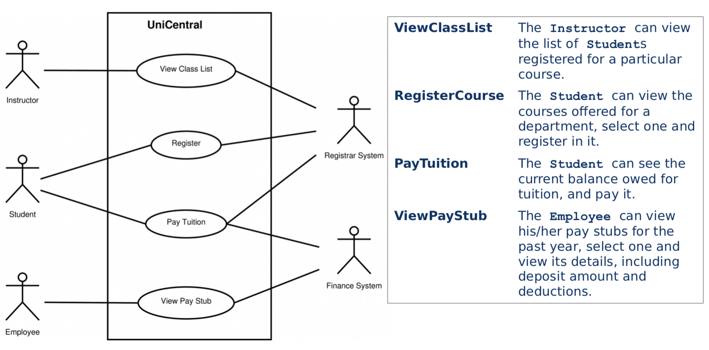
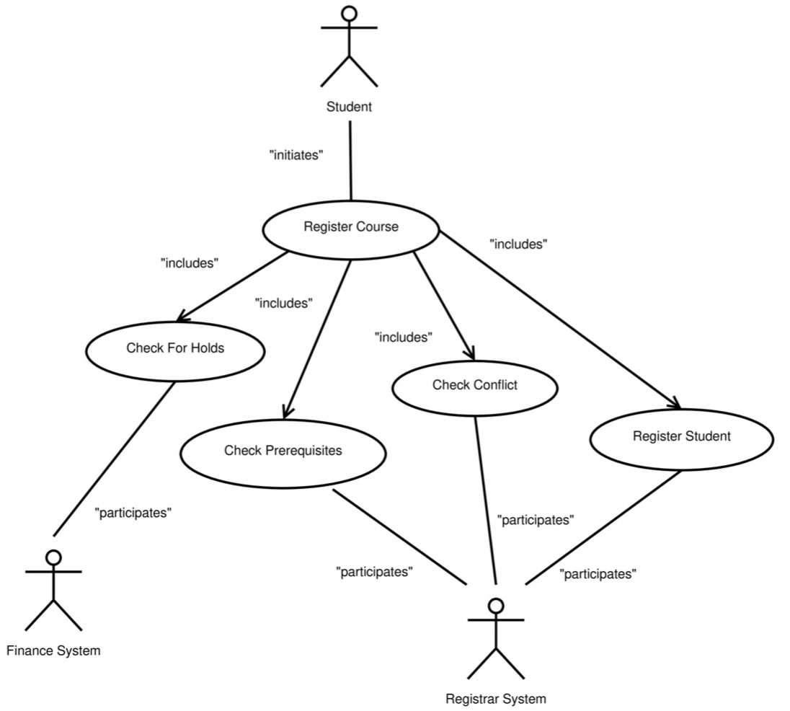
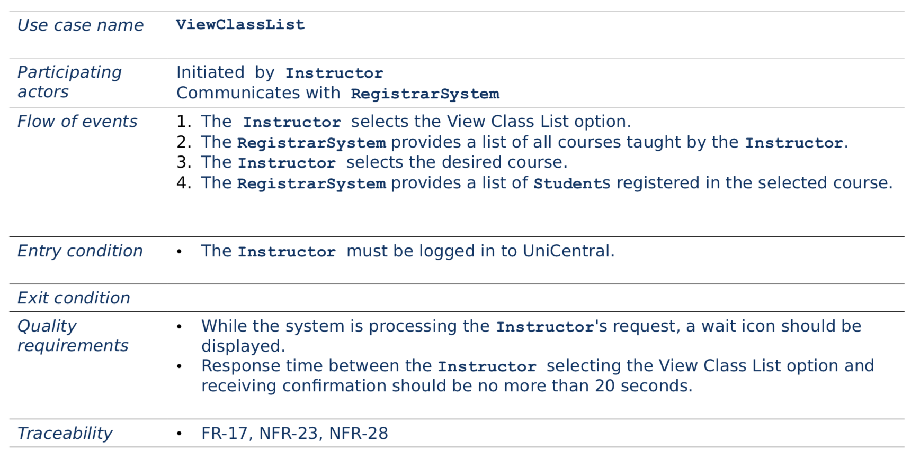
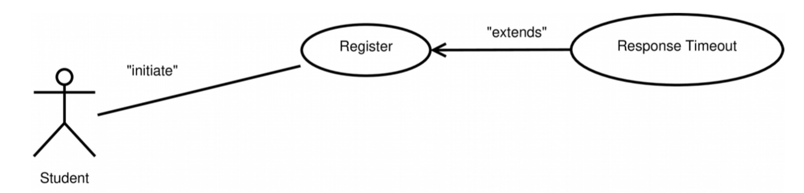
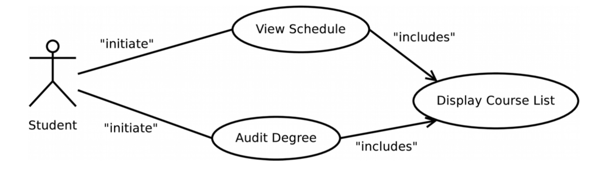
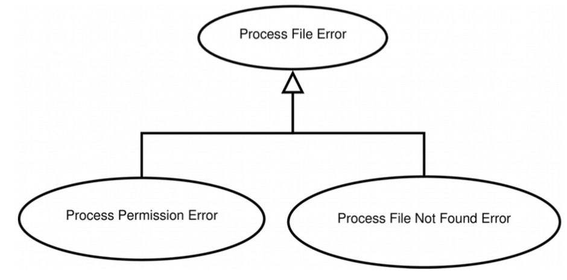
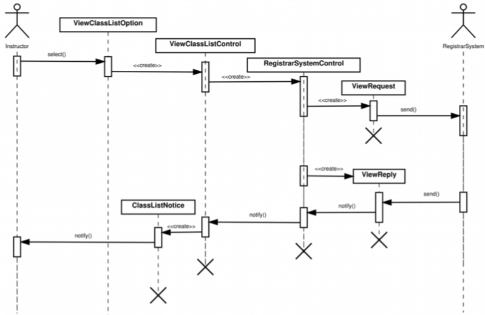
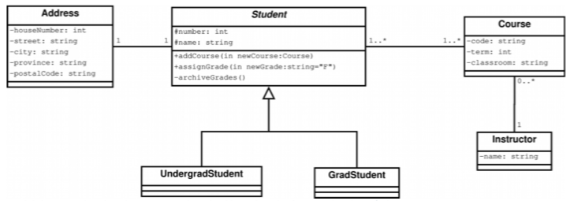
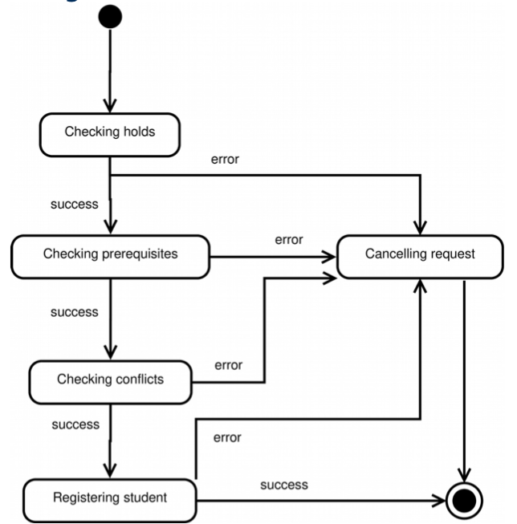

# Section 2: Requirements Analysis

## Sections Table of Contents

Section 1: [Introduction to Software Engineering](Section%201.md) 
Section 2: [Requirements Analysis](Section%202.md) 
Section 3: [High-Level System Design](Section%203.md) 
Section 4: [Detailed Object Design](Section%204.md) 
Section 5: [Implementation](Section%205.md) 
Section 6: [Testing](Section%206.md) 
Section 7: [Software Management](Section%207.md) 
Section 8: [Professional Ethics](Section%208.md) 

## Section 2 Table of Contents

Section 2.1: [Overview](#section-21-requirements-analysis) 
Section 2.2: [Requirements Elicitation](#section-22-requirements-elicitation) 
Section 2.3: [Analysis](#section-23-analysis) 

# Section 2.1: Requirements Analysis

## Purpose

Requirement analysis is the first of the 5 phases of the **software development lifecycle**.

1. requirements analysis
2. high-level system
3. detailed object design
4. implementation
5. testing

The **role of development team**, in the requirement analysis is to **understand the problem**, and to **model the application domain**.
- **results in:**
  - functional requirements
  - functional model
  - the non-functional requirements
  - the dynamic model
  - the analysis object model

## Breakdown

### Requirements Elicitation

- first gather a detailed + complete set of requirements
  - from clients information
  - _use-cases + scenarios_
  - should create a **system specification**
    - that can be understood by client
    - from user's point of view
    - including functions + non-functional requirements

### Requirements Analysis

- create high-level model
  - given the requirements
  - focus on **system / object behaviour**
  - from user's point of view
  - non-technical
  - _state-machine / sequence activity diagrams_

# Section 2.2: Requirements Elicitation

**Elicitation:** getting information from the client, for the development team. 
**Requirements:** what the client wants the system to do (i.e. features / tasks), and design constraints.

## Types of Requirements
**Functional:** what the system does (not how)
- features
- tasks
- interactions between system and external environment

**Non-functional:** the user-visible constraints on the system
- non-functional aspects of the system...
- specific + testable

## Non-Functional Requirements (NFR)
Main categories:
- usability
  - ease of use (colour scheme)
  - online help (documentation)
- reliability
  - load performance
  - dependability (fault-tolerance + security)
- performance
  - response time + throughput
  - availablity
- supportability
  - maintainability
  - portability

## Requirements Specification

**Requirements specification:** is a system definition that the client understands, that serves as a contract between the client and the development team.
- they are **complete / consistent / unambiguous**
- includes functional requirements
  - embodied in the functional model
- non-functional requirements

## Traceability

**Every requirement is tracked** through development lifecycle (use-cases -> system functions -> test cases)
- all **dependencies documented**
- facilitates maintenance of project
  - change impact easier to assess
- achieved with numbering requirements and cross-referencing

## Requirement Validation

**Requirement specification** must be validated by the client and development team for:
completeness
- consistency
- clarity
- correctness
- realism
- verifiability
- traceability

## Dorc Slayer Case Study

**Functional requirements:**
- FR-01: player can save the game
- FR-02: player can restore saved game
- FR-03: player can control character
  - FR-03-01: move the character
  - FR-03-02: wield weapon
  - FR-03-03: hit another character
  - FR-03-04: eat food ration from inventory
  - FR-03-05: view inventory

**Non-functional requirements:**
- NF-01 UI shows character health _(usability)_
- NF-02 game should be recoverable after crash _(reliability)_
- NF-03 configurable graphics _(performance)_
- NF-04 show be extensible to other graphics libraries _(supportability)_
- ...

## Requirements Elicitation Activities

**Identifying:**
- actors
- scenarios
- use-cases (+ refining)
- actor / use-case relationships
- initial analysis objects
- non-functional requirements

## Identifying Actors

**An actor** is an entity that **interacts** with the system; they are **role abstraction**.
- e.g. people / users
  - that need **access to the system**
  - that **execute** the main **functionality** of the system
- e.g. external systems
  - for input / output data
  - (high-level functional systems, not implementation details)
    - _OS / libraries are not external systems_

Actors are useful for **defining the system boundaries**.

## Identifying Scenarios

**A scenario** is a _**component**_ of a **use-case** that describes the system as **user interactions**; they describe a **single feature** from the **point of view** of a user.

Scenarios help figure out the main system functionality.
- allows for clients + users to understand:
  - application domain
  - system

Scenarios can be used to create test plans.

To identify a scenario, you can use:
- interviews with clients / users
- application domain + procedure manuals
- UI mock-ups

The goal is to **identify**:
- **tasks** performed by actors
- **information** created / accessed / modified by actors
- **interactions** between actors + system

## Identifying Use-Cases

**A use-case** is a **set of scenarios** that describes user / system interactions, **initiated by an actor**; it distinguishes user steps / system steps.

Use-cases are used to **facilitate client / developer communication**, and to **establish system scope**.

They can be identified by using generalized high-level scenarios and asking clients / users about:
- alternatives
- feature details
- constraints

### High-Level Use-Case Diagram

`// high-level use-case diagrams are contained in a box`

### Detailed Use-Case Diagram

Then use detailed use-cases.

Use-cases are represented with:
- **table-based text descriptions**
  - unique use-case name
  - actors
  - event flow
    - responses should be indented
    - other use-cases referenced using **extends** / **includes** / **inherits**
  - entry conditions
  - exit conditions
  - quality requirements
  - traceability
- **UML use-case diagrams**
  - there is no order specified
    - it would be shown in the text description
  - there should be no mapping to menu navigation
    - button presses are not states

### Table-Based Description

## Identifying Relationships

**Relationships:**
- between actors and use-cases:
  - **communication**
    - initiation / participation
    - permissions
- between use-cases:
  - extend
  - include
  - inherit

Use-case relationships are represented using:
- case diagrams (arrows + labels)
- case table-based text description
  - using **extends** / **includes** / **inherits** (bold font)

**Extend** relationship is when one use-case **extends the functionality** of another.
- used only for **exceptional** event flow (i.e. `Exceptions`)
  - e.g. **`ResponseTimeout`** extends **`Register`**
- origin case is not aware about extending case
  - extending case must have specific entry condition

`// arrows can be dotted or not`

**Include** relationship is used to remove **redundant functionality** and break down the system complexity.
- e.g. **`ViewProfile`** for animals and users
- origin use-case triggers included use-case
- included case is not aware of origin use-case

`// arrows can be dotted or not`

**Inheritance** relationships indicates **use-case sub-types**.
- this is not the same as **includes**

## Identifying Initial Analysis Objects
**Initial analysis objects** are the main **participating objects** present in the system (i.e. objects in the use-case).
- identified by using use-cases to find:
  - recurring nouns
  - real-world entities + processes
  - data-sources / data-sinks

These objects are then collected in a glossary / data-dictionary.

## Identifying Non-Functional Requirements

**Non-functional requirements** are user-visible constraints, used to document the client's needs; they are used to help prioritize conflicting requirements.

**Categories:**
- usability
- reliability
- performance
- supportability
- implementation
- interface
- operations
- packaging
- legal

# Section 2.3: Analysis

High-level object categories:
- entity
- control
- boundary

**Object model** construction:
- associations (inheritance / aggregation)
- directionality / multiplicity
- UML class diagrams

**Dynamic model** construction (based on functional requirements):
- UML sequence diagrams
- state-machine diagrams
- activity diagram

## Analysis Phase

The **analysis phase** is highly **iterative / incremental**, and is not necessarily for the client.
- the **focus** is on:
  - structuring / formalizing the requirements
  - defining / describing the application domain
  - from the user's point of view

## Analysis Concepts

### Analysis Object Model

The **analysis object model** is composed of **UML class diagrams** and is used for high-level concepts manipulated by the system.
- and their properties / relationships

_**Objects:**_
- **entity:** persistent information used by the system
- **boundary:** interactions between actors and the system
- **control:** in charge of realizing use-case

This model allows for **encapsulation** and **separation** between the interface and functionality _(boundary vs. entity + control objects)_.
- this provides better maintenance / modifiability / extensibility.

Classes should be named according to their category.

### Dynamic Model

The **dynamic model** is used to capture system behaviour from an external perspective, using **UML sequence diagrams** and **UML machine diagrams**.
- **sequence diagrams** show interactions between objects in one use-case
- **machine diagrams** show the behaviour of one object

### Generalization + Specialization

**Generalization:** identifying abstract concepts from specific concepts

**Specialization:** identifying specific concepts from general concepts

These are the concepts for inheritance.

## Analysis Activities

- identify: **entity** / **boundary** / **control objects**
- map **use-case** to **sequence diagrams**
- identify **associations** / **aggregates** / **attributes**
- modelling **state-dependent behaviour**
- modelling **inheritance relationships**
- reviewing **analysis model**

### Identifying Entity Objects

To **identify entity objects**, start by examining all the use-case for:
- recurring nouns
- real-world entities + processes
- data-sources / data-sinks

List these entity objects in a data-dictionary, with attributes, associations, and definition.

### Identifying Boundary Objects

**Boundary objects** are the **interface between actors and the system**. They collect information from the user, for use by control and entity objects.
- e.g. buttons, forms (high-level), notifications

**Identify by looking for:**
- UI controls that initiate use-cases
- forms used to gather information
- messages used by the system

### Identifying Control Objects

**Control objects** are used to **manage the control flow of a single use-case**; they are created and destroyed within the single use-case.
- a use-case may use multiple control objects
  - one per actor

Control objects are used to coordinate boundary and entity objects:
- collecting **information** from **boundary objects**
- **communicating** it to **entity** and other **control objects**

**Identify by looking for:**
- one control per actor in a use-case
  - ensure control object life span is contained in the use-case

### Use-Case to Sequence Diagrams

**Mapping use-case diagrams to sequence diagrams** is done **to uncover new objects** and **to identify new [object] operations**.

**Sequence diagrams:**
- are linked to a single use-case, and its participating objects
- show use-case behaviour amongst objects
  - model high-level object interactions

**Strategy:**
- leftmost column: initiating actor
- second column: boundary object
- third column: main control object
- further columns:
  - additional **control** objects **created** by **boundary** objects
  - additional **boundary** objects **created** by **control** objects
  - **entity** objects **accessed** by **control / boundary** objects
    - _never the other way around_

### Identifying Associations

**Associations** are the **relationships between objects**; they **describe dependencies** and allow for the discovery of special cases.

**Properties:**
- **multiplicity:** range / number of instances
- _**name:**_ optional, non-unique
- _**role:**_ optional, purpose of class in the association

### Identifying Aggregates

**Aggregates** are the **_has-a_ relationship** between objects. There are two types of aggregation: composition and shared.

**Composition:**
- both objects are dependent on each other to exist
- UML: ◆

**Shared:**
- both objects can exist independently
- UML: ◇

### Identifying Attributes

**Attributes** are **properties** of individual objects. They are with  a **name** and **data type**.
- objects are not shown as attributes, only as associations

### Modelling State-Dependent Behaviour

**Modelling state-dependent behaviour** is done to show the behaviour of a single object and perhaps identify new behaviour.

**State-machine diagrams** are used for long-lived objects with state-dependent behaviour, not for every object.
- **almost always:** control objects
- **sometimes:** entity objects
- **almost never:** boundary objects

### Modelling Inheritance Relationships

**Modelling inheritance relationships** is done to help generalize class attributes and behaviours.
- UML: △

### Reviewing the Analysis Model

The **final step** in requirement analysis is to review the analysis model for:
- **correctness:**
  - glossary is accurate and understandable
  - abstract classes correspond to user-level concepts
  - descriptions match user's defintions
  - **entity / boundary** objects named with **noun-phrases**
  - **use-cases + control** objects named with **verb-phrases**
  - error-cases described and handled
- **completeness:**
  - each **object** is required by a use-case
  - each **object** indicates which use-case(s) create / modify / destroy it
  - each **object** is accessed by a boundary object
  - each **attribute** indicates when set
  - each **attribute** indicates its datatype
  - each **attribute** is a qualifier
  - each **association** indicates when it is traversed
  - each **association** has a justified multiplicity
  - each **association** indicates whether one-to-many / many-to-many are qualified
  - each **control object** has the necessary associations for its use-case
- **consistency:**
  - unique class and use-case names
  - similar names for similar concepts
  - inheritances with objects with similar attributes and behaviour
- **verifiability:**
  - prototypes built for novel features
  - performance and reliability requirements verified with prototypes on target hardware
