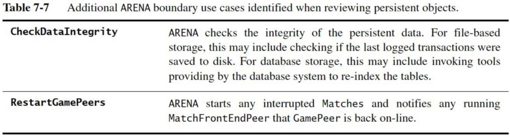

# Section 3: High-Level System Design

## Sections Table of Contents

Section 1: [Introduction to Software Engineering](Section%201.md) 
Section 2: [Requirement Analysis](Section%202.md) 
Section 3: [High-Level System Design](Section%203.md) 
Section 4: [Detailed Object Design](Section%204.md) 
Section 5: [Implementation](Section%205.md) 
Section 6: [Testing](Section%206.md) 
Section 7: [Software Management](Section%207.md) 
Section 8: [Professional Ethics](Section%208.md) 

## Section 3 Table of Contents

Section 3.1: [Overview](#section-3.1-overview) 
Section 3.2: [Initial System Decomposition](#section-3.2-initial-system-decomposition) 
Section 3.3: [Design Patterns](#section-3.3-design-patterns) 
Section 3.4: [Refined System Decomposition](#section-3.4-refined-system-decomposition) 

# Section 3.1: Overview

1. Overview
2. Initial System Decomposition`*`
3. Design Patterns
4. Refined System Decomposition

`// * midterm will cover up to here`

## Purpose

The development team is responsible for turning the analysis model into a system design model.
- starting to map:
  - processes
  - data structures
  - hardware / software components

**Input:**
- non-functional requirements
- analysis object model
- dynamic model

**Output:**
- system design model
  - subsystem decomposition
  - system architecture strategies

## Work Products

The main tasks are to:
- identify system goals
- design initial system decompositions (subsystems)
- refine subsystems to meet all design goals

## Breakdown

Two main parts:
1. initial system decomposition
    - grouping classes into subsystem
2. refined system decomposition
    - addressing design goals
    - deciding on design strategies [high-level system]

### Initial System Decomposition

The goal of this phase is to determine the design goals / criteria from the requirements [and clients], and to divide the system into maintainable subsystems.
- using:
  - classic system architecture styles
  - established design patterns
  - UML class diagrams, component diagrams, and packages

- **Input:**
  - non-functional requirements
  - analysis object model dynamic model
- **Output:**
  - design goals
  - initial subsystem decomposition

### Refined System Decomposition

This phase establishes the runtime components and nodes.
- **identifies:**
  - persistent data
  - global control flow
  - access control policies
  - subsystem services
- **using:**
  - UML components
  - deployment diagrams

- **Input:**
  - analysis object model
  - dynamic model
  - design goals
  - initial subsystem decomposition
- **Output:**
  - refined subsystem decomposition
  - system architecture strategies

# Section 3.2: Initial System Decomposition

`// midterm includes this section (inclusive)`

## Overview

A basic introduction into architectural styles:
- repository
- client-server
- peer-to-peer
- MVC
- 3-tier
- 4-tier

Initial system decomposition establishes design goals based on non-functional requirements.

A breakdown of the analysis object model into high-level subsystems, with UML component diagrams.

## Subsystems and Classes

A subsystem is a group of related classes, in the same system, and part of the solution domain.
- they have well-defined interfaces
  - _an interface is the set of public operators of a class_
- encapsulate state and behaviour
- can be assigned to one developer / one team

**Types of Subsystems:**
- logical: has **no** runtime equivalent
- physical: has **explicit** runtime equivalent

In C/C++ related classes are grouped in a sub-directory.

**Class Interface:** set of **public operations** provided by a **class**.

**Subsystem Interface:** set of **public operations** provided by a **subsystem**.
- _a set of services_

**Service:** related **set of operations** in a **subsystem interface**.
- subsystems offer services to other subsystems
- _name must be a noun phrase_

## Services

## Coupling

Coupling is the the number of dependencies (associations) between subsystems.
- **loose coupling** [good]
  - subsystems are relatively independent
  - modifications to one subsystem have strong impact on the other
- **strong coupling** [bad]
  - modifications to one subsystem have little impact on the other
  
Subsystems should be as loosely coupled as possible
- e.g. the storage subsytem should not be dependent on database implementation type

## Cohesion

Cohesion refers to the number of dependencies (associations) within a subsystem.
- **high cohesion** [good]
  - many objects in the subsystem are related to each other objects perform similar tasks
- **low cohesion** [bad]
  - the subsystem contains many unrelated objects

Subsystems should be as cohesive as possible; but this is a tradeoff with coupling.

## Layers

A layer is a grouping of subsystems providing related services.
- each layer depends on the lower layers
- and have no knowledge of the higher-level layers

**Closed Architecture:**
- each layer can only access the **immediate layers below**
  - loose coupling [good]
  - but introduces overhead [bad]

**Open Architecture:**
- each layer can access **any lower layer**
  - higher coupling but no additional overhead

## Partitions

Partitions are a **group of peer subsystems**, where **each group** is responsible for a **set of unique services**.
- loosely coupled
- groups can operate independently

System decomposition is made up of partitioning and layering of subsystems.

## System Architecture Styles

**Software architectural styles** are **ways of organizing / grouping subsystems** at the highest levels, and can be used as a basis for new systems.

- **Repository**
  - subsystems:
    - all access single data structure
    - loosely coupled [good] + highly coupled [bad]
    - communicate solely through repository [bottleneck]
  - synchronized through repository locks (e.g. mutexes)
  - good for:
    - complex data processing
    - adding new services
  - _e.g. database management systems / compilers_
- **MVC (model-view-controller)**
  - loose coupling between view and model [good]
    - allows for multiple views with shared models
  - maps well to entity-boundary-control objects
    - _based on the observer design pattern_
- **Client-Server**
  - server subsystems provide services to client subsystems
    - using remote procedure calls (RPC) + sockets
  - client subsystems interact with users
  - subsystems are independent (loose coupling) [good]
    - good for distributed systems
  - synchronizes only with messages
  - _special case of repository_
  - _e.g. information system with central database_
- **Peer-to-Peer**
  - generalization of client-server
    - subsystems can be both clients or servers
  - good for distributed systems
  - synchronizes only with messages
  - higher risk of deadlock
  - _e.g. database that accepts requests and notifies others of any changes_
- **Three-Tier**
  - interface / application logic / storage layers
    - interface: boundary objects
    - application logic: control / entity objects
    - storage: implements storage and retrieval of persistent objects
      - can be shared by multiple applications
    - _like MVC but storage is external to application?_
- **Four-Tier**
  - presentation client / presentation server / application logic / storage layers
    - same as three-tier but application logic split:
      - client layer [located on client hosts]
      - server layer [located on server hosts]
  - _e.g. facebook? different client interfaces for each user?_
- **Pipe and Filter**
  - filters are subsystems
  - pipes are associations between subsystems
  - used for data streams (simple)
  - bad for complex interactions between filters
  - _e.g. bash shell_

## Design Goals

Design goals should take into account:
- **performance**
  - response time
  - throughput
  - memory efficiency
- **dependability**
  - robustness
  - reliability
  - fault tolerance
  - security
  - safety
- **cost**
  - development
  - deployment
  - upgrade
  - maintenance
  - administration
- **maintenance**
  - extensibility
  - modifiability
  - adaptability
  - portability
  - readability
  - traceability
- **end user**
  - utility
  - usability

To **identify design goals** you you want to find the right balance of trade-offs based off the system requirements.
- assign objects in a use-case to one subsystem
- create **subsystems to move data** between subsystems
- **minimize** subsystem **associations**
  - and ensure all **objects** in the same subsystem are **related**

To **identify** subsystems:
- assign objects in a use-case to one subsystem
- create dedicated subsystems to move data between subsystems
- minimize associations between subsystems
  - ensure objects within a subsystem are related

# Section 3.3: Design Patterns

`// post-midterm`

Design patterns are sets of classes and their associations that provide a framework to solve common design problems. They should be robust, modifiable, and adaptable.

## Types of Design Problems
- **creational:** object creation [mechanisms]
  - _abstract factory_
- **structural:** simplification of object associations / relationships
  - _adapter_
  - _bridge_
  - _composite_
  - _façade_
  - _proxy_
- **behavioural:** communication patterns between objects
  - _command_
  - _observer_
  - _strategy_

## Abstract Factory

An **Abstract Factory** design pattern **enables creation of objects**, _independent of the client_.
- it provides an interface to inherited factory classes, with different implementations.
  - _e.g. products from different manufacturers_

The arena case study implements this design pattern, where the `Game` object is an abstract factory.

Notice how

## Adapter

An **adapter** design pattern exists as a **wrapper around existing / legacy code** to provide a new interface to the client.
- _e.g. new user interface for an old command line application_

`// only works if it's a wrapper for existing code`

## Bridge

A **Bridge** design pattern allows for alternate implementations with a single interface.
- like Adapter, but for **new code**
- e.g. _different storage implementations for one store_

In this picture, the store would be the abstraction, and the concrete implementors would be different storage implementations.

## Composite

A **Composite** design pattern represents a **recursive hierarchy**.
- Composite class inherits from _Component_ class
  - and Component class has many _Component_ objects
- allows for encapsulation of hierarchies
- e.g. _UI toolkits such as Java Swing_

## Façade

A **Façade** design pattern is used to **encapsulate subsystems**.
- provides a high-level / abstract interface for class operations.

## Proxy

A **Proxy** design pattern encapsulates expensive objects [expensive: performance / security].
- they provide a gateway to a real object

## Command

A **Command** design pattern is used to **encapsulate control flow**.
- used to provide generic user requests
- e.g. _execute, undo, store in Adobe Illustrator_

## Observer

An **Observer** design pattern is used to **seperate entity objects from the view**.
- subscriber / observer are notified
  - when changes to subject / publisher object occur
- used for propagating model changes across multiple views
- e.g. _MVC architecture style_

## Strategy

A **Strategy** design pattern is used to **encapsulate algorithms / context**.
- used for dynamically selecting behaviour based on context
  - like bridge, but implementation is decided by client
- e.g. _selecting network connections (Wi-Fi, Ethernet, etc)_

# Section 3.4: Refined System Decomposition

**Refined system decomposition** is used to group subsystems into components and nodes, by identifying:
- **persistent data**
- **access / global** control flow mechanisms
- **boundary conditions**
- subsystem **services and interfaces**

## System Strategies

**Software / Hardware Mapping:**
- used for off-the-shelf / legacy components
  - for hardware configuration
  - for internode communications

**Data Management:**
- used for identification of:
  - persistent data
  - storage locations
  - acces mechanisms

**Access Control:**
- used for:
  - authetication
  - authorization
  - confidentiality

**Control Flow:**
- used for control + concurrency

**Boundary conditions:**
- used for system initialization / shutdown
- edge cases

## Components and Nodes

**Components:**
- a single or group of subsystems

**Runtime components:**
- component with a unique _process_

**Node:**
- the physical device / environment running a component

**UML notation:**
- deployment diagrams used for components + nodes
  - showing relationships between _runtime_ components + nodes

**System:**
- a group of runtime components
  - may be distributed across multiple nodes

### UML Deployment Diagram

## Refined Decomposition Activities

1. Mapping subsystems to components
2. Storing persistent data
3. Providing access control
4. Designing global control flow
5. Identifying services
6. Identifying boundary conditions

## Mapping Subsystems to Components

Steps form ***mapping subsystems to components:**
1. select hardware configuration + platform
  - decide on nodes + select hardware
  - determine communication methods
  - determine software
    - OS / legacy software / COTS software
2. allocate objects + subsystems to nodes
  - to enable equitable distribution
    - of functionality
    - processing power

## Storing Persistent Data

**Persistent data** is any data that persists between system executions.
- need to be aware of impact due to storage methods
  - access control
  - concurrency

***Persistent Objects** may be:
- entity objects
- user information
- aspects of boundary objects _[e.g. submitted forms saved]_
- objects that must survive system shutdown

In order to **select a storage management strategy:**
- you must take into account _non-functional requirements_

### Persistent Storage Strategies

**Flat Files:**
- low-level sequence of bytes
- can be very fast
- issues with concurrency / data loss

**Relational Database:**
- tables of a predefined schema
- mapping objects to schema may be complex
- built in concurrency / access control / crash recovery
  - _most common approach_

**OO Database:**
- supports objects and their associations
- slower than relational database

### Trade-Offs

**Flat files:**
- good for large + temporary data
- low information density

_**Databases:**_
- good for concurrent + detailed access
- good for cross-platform / cross-application

**Relation databases:**
- good for complex queries
- good for large data

**OO databases:**
- good for association-based queries
- good for irregular associations

## Providing Access Control

**Access control** is what determines what actors have access to what information.
- _e.g. authentication / confidentiality / authorization_

### Types of Access Control

**Authentication:**
- Determining whether an actor is who they say they are
  - e.g. _log in credentials / NFC chip / biometrics_

**Confidentiality:**
- Determining whether data can be accessed only by the intended actors
`// always use COTS software for this`

**Authorization:**
- Determining whether data + operations can only be accessed by the intended actors
`// always use COTS software for this`

### Access Matrix

To ensure **authorization** at the **object level**
- determine which **objects are shared by actors**
- identify which actors are authorized to perform which operations
  - on which shared objects
- use an _access matrix_ for this

**Global access table:**
- is a list of allowed tuples
  - (actor, class, operations)
- if tuple exists, then an operation is allowed

**Access control list:**
- is a list of tuples associated with **each class**
  - (actor, operations)
- each time an object is accessed, it is verified against the list

**Capability:**
- list of tuples associated with **each actor**

### Rule-Based Access Matrix

A **rule-based access matrix** is a compact representation, used when there are many actors and class.
- it can show access rules between broad categories of actors and classes.
- good for larger number of actors / classes

### Access Control Types

**Static access control:**
- is when access rights are known at **compile time**
- modelled as attributes of system objects
  - implemented as an **access matrix**

**Dynamic access control:**
- is when access rights are known at **runtime**
  - implemented with **Proxy design pattern**

## Design Global Control Flow

**Control flow** is the content and order of operations.

### Control flow mechanisms

**Procedure-driven:**
- a single flow of control
- blocking wait for input
- not natural for OO languages

**Event-driven:**
- like procedure-driven
- events are dispatched to other objects

**Threads:**
- like event-driven
- each thread responds to different event
- difficult to debug + test

**Control objects:** are used to implement control flow mechanisms
- they allow localization of a use-case's control flow
- for each external event
  - they record the event
  - store temporary event states
  - issue instructions to entity and boundary objects

## Identifying Services

To **identify subsystem services**
- first review subsystem dependencies
- then defined an interface for each service
  - public operations for the subsytem
  - _should be a noun-phrase_

## Identifying Boundary Conditions

**Steady state:**
- the normal operation of a system

**Boundary conditions:**
- abnormal operation of a system
  - described in boundary use-cases

***Examples:**
- system start-up / initialization / shutdown
  - normal + abnormal
- data corruption
- network outages
- administrative tasks
  - user management
  - data configuration

**Exceptions:**
- when an event / error occurs during system execution
- can be caused by:
  - hardware failure _(e.g. disk failure)_
  - operating envrionment changes (e.g. connection lost)
  - software fault _(e.g. software design flaw)_

**Role of exception handling:**
- how system deals with exceptions
  - e.g. _error messages_

### Strategy

To **identify boundary use-cases**:
1. analyze configuration of persistent objects
  - use-cases where persistent object created / destroyed
  - for objects that are never created / destroyed: administration use-case
    - e.g. _there needs to be an administration use-case to create objects such as **administrator user**_
2. analyze start-up / shutdown of each component
  - use-case for component:
    - _start-up_
    - _shutdown_
    - _configuration_
3. handle exceptions for each component failure
  - decide on system response
  - add an _extending_ use case

`// component is a collection of subsystems (or just one)`

## Refined Decomposition Recap

1. Group subsystems into components and nodes
  - components: group of 1+ subsystems
  - nodes: physical environment on which components run
2. Identify:
  - persistent data
  - access control
  - global control flow
  - boundary conditions
3. Then identify
  - subsystem services / interfaces