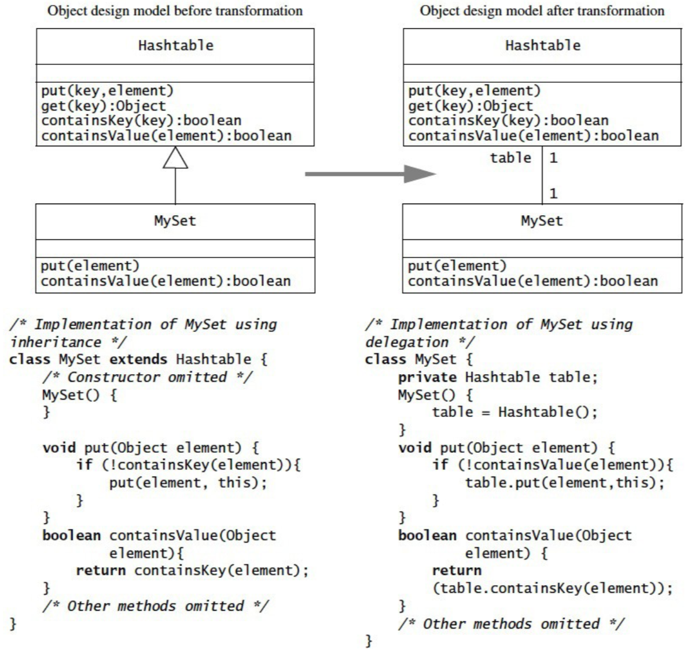
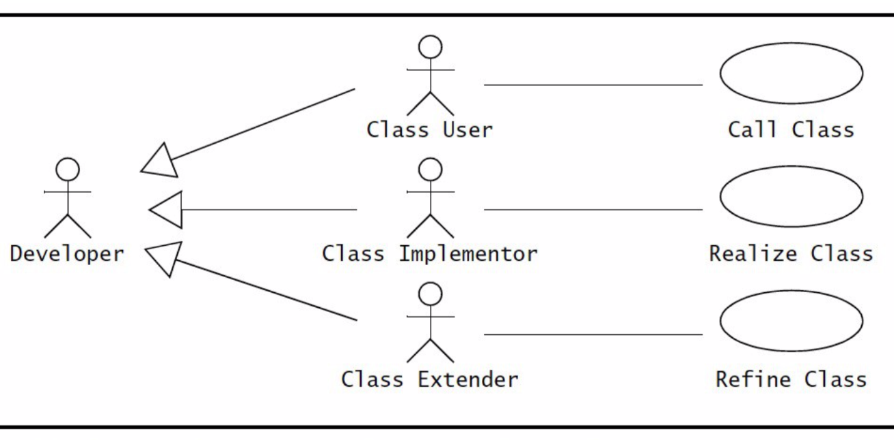

# Section 4: Detailed Object Design

## Sections Table of Contents

Section 1: [Introduction to Software Engineering](Section%201.md)<br>
Section 2: [Requirements Analysis](Section%202.md)<br>
Section 3: [High-Level System Design](Section%203.md)<br>
Section 4: [Detailed Object Design](Section%204.md)<br>
Section 5: [Implementation](Section%205.md)<br>
Section 6: [Testing](Section%206.md)<br>
Section 7: [Software Management](Section%207.md)<br>
Section 8: [Professional Ethics](Section%208.md)<br>

## Section 4 Table of Contents

Section 4.1: [Overview](#section-41-detailed-object-design)<br>
Section 4.2: [Reusing Pattern Solutions](#section-42-reusing-pattern-solutions)<br>
Section 4.3: [Specifying Interfaces](#section-43-specifying-interfaces)<br>
Section 4.4: [Refined System Decomposition](#section-44-refined-system-decomposition)<br>

# Section 4.1: Detailed Object Design

**Detailed object design** creates an object model that contains the solution domain.
- by identifying solution domain objects
- using:
  - **analysis object model**
  - **subsystem design model**
    - subsystem decomposition
    - system architecture strategies

## Tasks

1. Identify opportunities for **software reuse**
  - COTS components
  - design patterns
2. Specify **services**
  - interface specification
  - this becomes the API
3. **Restructure** object model
  - for _understandability + maintainability_
4. **Optimize** object model
  - for _performance requirements_

`// COTS: common-off-the-shelf`<br>
`// API: application programming interface`

# Section 4.2: Reusing Pattern Solutions

**Reusing** already exiting tools / frameworks / subsystems is **faster and cheaper** than designing form scratch.
- this allows for **modifiability + extensibility**

**Major Design Patterns:** creational, structural, behavioural

## Application and Solution Objects

**Application objects** _(domain objects)_ represent concepts from the application domain.

**Solution objects** represent objects specific to the solution domain
- they do not have an application domain counterpart
  - _e.g. persistent data stores, UI objects_

## Specification and Implementation Inheritance

In C++ one has many inheritance tools at their disposal.
- all inheritance relationships should be within the same subsystem
  - since inheritance is _"the strongest"_ relationship two classes can have.

**Focus of inheritance** in _analysis phase_:
- is to set up generalization / specialization taxonomy
  - _classification of objects_

**Focus of inheritance** in _object design phase_:
- is to reduce redundancy
- and to enhance extensibility

**Impact of inheritance** on coupling:
- decouples client classes from a subclass
  - _client accesses super-class (like a façade)_
- introduces strong coupling between parent and child class

### Specification Inheritance
- using inheritance to classify concepts into type hierarchies
  - "is-a" relationship between generalized + specialized classes
  - _classic inheritance_

### Implementation Inheritance
- **not** an **“is-a”** relationship
- use of inheritance purely for purposes of **code reuse**
- superclass functionality is reused by:
  - _sub-classing_
  - _refining behaviour_
- quick and dirty way to reuse operations
  - can result in unintended consequences
- not an intuitive use of inheritance

**Example:**

> When creating a class named _MyStack_ which is a FIFO stack implementation that uses the C++ vector implementation, the programmer is presented with 2 choices:
>
> 1. Compose MyStack with Vector
> 2. Make MyStack inherit from Vector (implementation inheritance)
>
> If option 2 was chosen it would likely yield the unwanted consequence of inheriting all the Vector methods from Vector onto MyStack (even through MyStack shouldn't support those operations)

## Delegation

**Delegation** is an alternative to _implementation inheritance_ which relays messages to another class.
- this makes **dependencies explicit**
  - between new and reused classes
- relationship becomes an **aggregation** relationship
  - _instead of inheritance_



In this example, **MySet** _delegates_ to **Hashtable**, instead of inheriting methods from **Hashtable**.

## Liskov Substitution Principle

**Definition:**
- assume T is a superclass and S is a subclass of T
- _"if an object of type S can be substituted in all places where an object of type T is expected, then S is a subtype of T"_
  - if S can used everywhere T is used, then S is child of T

`// in other words:` **`polymorphism`**

**Consequences:**
- an operation on T can be called on instances of S, without knowing that it is called on a subclass instance
- client classes using operations on T don’t have to change when new subclasses of T are added

**Strict Inheritance:**
- when all inheritance associations are specification inheritance

_In essence, wherever one can use *polymorphism*, strict inheritance is present_

## Delegation and Inheritance in Design Patterns

**Design patterns** are templates of solutions to recurring  design  problems.
- a set of classes to solve common problems
- that are robust + modifiable + adaptable

`// most design patterns use inheritance + delegation`


## Reuse Activities

These activities are design to increase **modifiablility + extensibility**.

Due to frequent changes during the development phase caused by:
- new vendor / new technology
- changes to implementation
- new views
- new complexity of application domain
- errors in original requirements

## Encapsulating Data Sources

**Bridge design pattern:**
- good for multiple concrete implementations with a common interface
  - similar to strategy but implementation is static
  - _like a façade but using inheritance_
- e.g. _multiple data storage technologies_

## Encapsulating Legacy Components

**Adapter:**
- good for modifying a legacy / existing component interface
  - similar to bridge but with existing code
- e.g. _new UI for existing backend_

## Encapsulating Context

**Strategy design pattern:**
- good for dynamically changing between concrete implementations based on context
  - same as bridge but client decides implementation
- e.g. _changing network connection type dynamically_

## Encapsulating Platforms

**Abstract factory:**
- good for shielding client from object creation process
  - of related objects
  - and prevents use of incompatible objects
- e.g. _products from different manufacturers_

## Encapsulating Control Flow

**Command:**
- good for generic user requests
  - without having to know request contents
- e.g. _execute / undo / store_

## Encapsulating Hierarchies

**Composite:**
- good for representing recursive hierarchy
  - and adding new components without affecting existing ones
- e.g. _UI toolkits_

## Maintaining Consistency

**Observer:**
- good for propagating model changes across view
- e.g. _MVC architecture_

## Heuristics for Selecting Design Patterns

### Abstract Factory
- manufacturer independence
- platform independence

### Adapter
- compliance with existing interface
- reuse of existing legacy component

### Bridge
- support for future protocols

### Command
- all commands should be logged
- all commands should be reversible

### Composite
- support for aggregate structures
- hierarchies with variable depth / width

### Strategy
- decoupling of policy and mechanisms
- interchanges of algorithms at runtime

# Section 4.3 Specifying Interfaces

**Specifying interfaces** is focused on specifying **boundaries between objects**.
- integrating all existing / partial models into one coherent whole

**Steps:**
- Identify missing attributes and operations
  - augment object design model
- specify visibility and signatures
  - decide on operations available to other objects and subsystems
  - determine operation signatures and return types
- specify contracts
  - describe object and operation behaviour in terms of constraints

## Class Developer Roles (Part of Contracts)

**Class Developers** have three possible roles:
- class **implementer**
- class **user**
- class **extender**



### Class Implementer

The **class implementer writes** the class.
- implements the class
- designs the internal data structures
- implements the code for the operations
- designs the interface specification

### Class User

The **class implementer uses** the class from another class.
- invokes the class operations from another class, called the client class
- uses the interface specification as boundary to the class

### Class Extender

The **class implementer writes** the class code.
- develops specializations of the class
- uses interface specification as indication of:
  - the behaviour of the class
  - the constraints on the class

## Contracts

A **contract species constraints** on a class that:
  - must be **ensured** by:
    - class implementer
    - class extender
  - must be **met** by:
    - class user

Contracts include **three types of constraints**:
- _invariant_
- _precondition_
- _postcondition_

### What is an _Invariant_?

- predicate that is **always true for all instances** of a class
- associated with a class or an interface
- used to specify consistency constraints among attributes
- _e.g. client age cannot be negative_

#### Example:

> maximum number of players in tournament must be greater than 0
> given a Tournament object t:

``` pascal
t.getMaxNumPlayers() > 0
```

### What is an _precondition_?

- predicate that **must be true before an operation** is invoked
- associated with an operation
- used to specify constraints that class user must meet before invoking the operation

#### Example

> example of precondition for acceptPlayer() operation:
> - player must not already be accepted, and the current number of players must be less than the maximum
> - given a Tournament object t and player p:

```pascal
!t.isPlayerAccepted(p) and t.getNumPlayers() < t.getMaxNumPlayers()
```

### What is an _postcondition_?

- predicate that **must be true after an operation** executes
- associated with an operation
- used to specify constraints that class implementer and extender must ensure after execution

#### Example
> example of postcondition for acceptPlayer() operation:
> - accepting a player must increase the player count by 1
> - given a Tournament object t and player p:

``` pascal
t.getNumPlayers_afterAccept() = t.getNumPlayers_beforeAccept() + 1
// => true if (t.getNumPlayers_beforeAccept() + 1) succeeds
```

`// (=) operator is logical comparison in pascal`

## Object Constraint Language

**Object Constraint Language** [OCL] is a **formal language to specify constraints**.
- may be used for constraints on:
  - single model elements
    - _attributes / operations / classes_
  - groups of model elements
    - associations / participating classes
- syntax is Pascal-like
- represents constraints as boolean expressions

``` go
# `=` is comparison
1 = 2
# => false

# `=:` is assignment
a = 1
a
# => 1
```


## OCL Collections

**Constraints** are based on navigation along associations:

1. **local attribute**
  - uses local attribute
2. **directly related class**
  - uses a single association
3. **indirectly related class**
  - uses a series of indirect associations

## OCL Qualifiers

`// omitted from final`

`// todo: finish this - slide 22 [omitted]`

## Interface Specification Activities

1. Identifying missing attributes and operations
2. Specifying types, signatures, visibility
3. Specifying preconditions and postconditions
4. Specifying invariants
5. Inheriting contracts

## Identifying Missing Attributes and Operations

`// todo: finish this - slide 23 [omitted]`

## Specifying Preconditions and Postconditions

`// todo: finish this - slide 26 [omitted]`

## Specifying Invariants
`// todo: finish this - slide 29 [omitted]`

**Heuristics:** (on specifying invariants)
- focus on the lifetime of the class
- avoid any constraints
  - specific to operations
  - specific to certain states

## Recap

How to construct the detailed object model.
- extending the object model
  - adding details to the initial object model