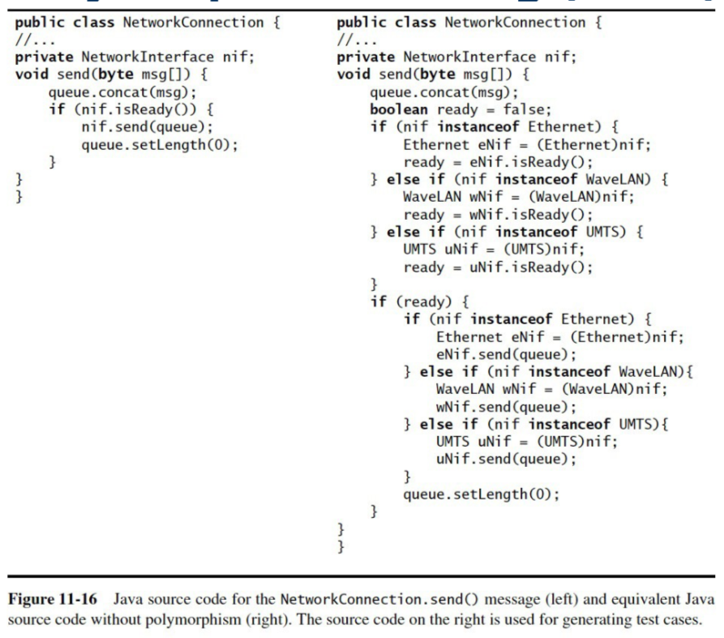

# Section 6: Testing

## Sections Table of Contents

Section 1: [Introduction to Software Engineering](Section%201.md) 
Section 2: [Requirements Analysis](Section%202.md) 
Section 3: [High-Level System Design](Section%203.md) 
Section 4: [Detailed Object Design](Section%204.md) 
Section 5: [Implementation](Section%205.md) 
Section 6: [Testing](Section%206.md) 
Section 7: [Software Management](Section%207.md) 
Section 8: [Professional Ethics](Section%208.md) 

## Section 6 Table of Contents

Section 6.1: [Overview](#section-6.1-overview) 
Section 6.2: [Unit Testing](#section-6.2-unit-testing) 
Section 6.3: [Integration Testing](#section-6.3-integration-testing) 
Section 6.4: [System Testing](#section-6.4-system-testing) 

# Section 6.1: Testing

**Unit Testing:** for blackbox / whitebox testing 
**Integration Testing:** selecting testing integration strategy, and for stubs and driver test cases 
**System Testing:** for test cases based on functional model

**Testing** is a **systematic attempt** to find faults – deviation between **specified + observed system behaviour**.
- using test cases to expose system faults
  - test should be done by either:
    - developers not involved in design / implementation
    - dedicated testers

**Failure:** deviation of specified / observed behaviour

**Error State:** a state where further processing will lead to failure

**Fault:** a defect / bug; the cause of an error

## Basic Concepts

- software reliability
- code reviews
- testing approach
- blackbox / whitebox testing
- faults / error states / failures
- test cases
- test stubs and drivers
- corrections

### Software Reliability

**Software Reliability** is the degree to which the specified behaviour **matches** observed behaviour.
- to increase reliability:
  - fault avoidance / detection / tolerance

**Fault avoidance:**
- detecting faults in the model (before execution)
  - using:
    - _development methodologies_
    - _configuration management_
    - _verification_

**Fault detection:**
- detecting faults in the implementation
- identifying error states + faults
  - by debugging _(uncontrolled)_
  - by testing _(controlled)_

**Fault tolerance:**
- dealing with faults + system failures
  - recovering from these at runtime

### Code Reviews

A **code review** is a manual inspection of code without execution.
- performed by a review team
  - developers + QA
- critical component for safety-critical projects
- **advantage:** can uncover many faults / bugs
- **disadvantage:** time consuming

**Types:**
1. **Walkthrough:** developer present their code
2. **Inspection:** review team inspects the code

**Goals:**
- review the code against function + non-functional requirements
- check for efficiency
- check for accuracy + completeness of comments

### Testing Approach

Testing should be approached to find system faults.
- _best to select data with a high likelihood of finding a bug_
  - if you don't find bugs
    - more likely tests are not thorough enough

**Testing planning:**
- create test plan for unit + integration testing beforehand
  - as soon as model is stable

**Usability testing:**
- testing UI / UX

**Unit testing:**
- testing use-case objects + subsystems
  - must include whitebox + blackbox testing

**Integration testing:**
- testing how components work together
  - including structural testing _(all components together)_

**System testing:**
- testing system as a whole
  - including all scenarios + requirements + design goals
- **functional testing**
  - based on _requirements analysis document_
- **performance testing**
  - based on _system design document_
- **acceptance testing**
  - based on _project agreement_ (performed by client)

### Blackbox / Whitebox Testing

A **test component** is a part of the system that is isolated for testing.
- can be:
  - _object(s)_
  - _subsystem(s)_

**blackbox:** testing **output** based on **input**
- no access to internal components

**whitebox:** testing internal components
- testing dynamic model states
  - and object interactions

`// unit testing must include both: blackbox + whitebox tests`

### Faults / Error States / Failures

**Algorithmic:**
- due to incorrect implementation
- may be introduced during:
  - _analysis_
  - _design_
  - _implementation_
- e.g. _data structure overload / lack of initialization / performance issues_

**Mechanical:**
- due mechanical faults
  - _e.g. power failure_

### Test Cases

A **test case** is a set of inputs and their expected outputs for a component.
- with the goal of finding failures + faults
- tests can be carried out in parallel

**Test case attributes:**
- **unique name:** derived from requirement / component
- **component under test:** operations / classes / subsystem
- **input:** input data / commands entered by actor
- **expected output:** expected results

**Test case dependencies:**
- **functional testing:** based on function model / use-cases
- **unit testing:** based on subsystem interface

**Test case associations:**
- **aggregation:** test case decomposed into sub-tests
- **precedence:** order in which tests must be executed
  - defined with **precedes** keyword

`// minimizing test case associations allows for more parallelization`

### Test Stubs and Drivers

In order to **test isolated components**
- something must **call** test component
- something must **execute** when test component call other components
  - _we need to simulate missing components_

**Test Drivers:** simulates part of system that calls the test component
- passes test inputs
- shows test results

**Test Stubs:** simulate missing components
- hardcoded implementation of other components
  - _e.g. generates test data and API response_

### Corrections

A **correction** is a modification to repair a fault in a tested component.
- _this may introduce a new fault_

**Problem tracking:**
- documenting all errors and code fixes

**Regression testing:**
- re-running all tests after a code fix
- ensuring existing functionality is not compromised
  - ideally automated

**Rationale maintenance:**
- documenting reasons for corrections
  - ensuring no new faults  are introduced
    - due to violations of prior assumptions

## Usability Testing

**Usability testing** is focused on finding the **differences** between the **system behaviour** and **user expectations**.
- such as:
  - _UI details_
  - _screen layout_
  - _sequence of interactions_
  - _hardware_

### Approach
1. developers set out test objectives
2. participants accomplish predefined tasks
3. developers observe + collect data

### Types of Usability Tests

**Scenario test:**
- present users with a scenario
- developers gauge user reactions
  - can use _storyboard or prototype_

**Prototype test:**
- present users with software implementing key aspect of system
  - **vertical prototype:** implements one use case completely
  - **horizontal prototype:** implements one layer (e.g. UI prototype)

**Product test:**
- present users with functional system

# Section 6.2: Unit Testing

**Unit testing** is focused on testing objects + subsystems.
- collections of objects tested only after each individual object is tested

## Characteristics

- reducing complexity of testing process
  - early testing in implementation process
    - makes finding faults easier
- allows for parallelization of tests

## Units

Units to be tested are **selected from**:
- **object model**
  - objects in use-cases should be tested
- **subsystem decomposition**
  - subsystems tested after individual classes tested

## Techniques for Unit Testing

### Equivalence Testing

**Equivalence testing** minimizes the number of test cases
- by grouping input into equivalent classes
- only one member of each equivalent class is tested
  - e.g. _testing only 1 month out of 12 possible_

**Criteria:**
- each input should only belong to one equivalence class
- each input should only belong to one equivalence class
- any error for one member should occur for all members of an equivalence class

### Boundary Testing

**Boundary testing** is a special case of equivalence testing.
- where the focus ins on boundary conditions
  - this reduces test coverage but simplifies tests
    - risks not finding some defects

### Path Testing

**Path testing** is a whitebox technique for finding faults by executing all possible paths through the code.
- by traversing all edges in a test component flow chart
- this does not test defects due to:
  - code omissions (i.e. _missing paths_)
  - invariants of data structures

### State-Based Testing

**State-based testing** compares the state of a system to an expected state, using classes.
- achieving a specific state can be complex

### Polymorphism Testing

**Polymorphic testing** checks all possible dynamic bindings.
- expands source code in order to:
  - **typecast** to possible subclasses
    - and **invoke operations** on subclass
  - construct flow graph _(due to type)_
  - perform path testing

# Section 6.3: Integration Testing

**Focus:** testing small group of already unit-tested components.
- allows for more complex tests
- first individual components are tested individually
  - then groups are tested together
  - _allowing for complex parts to be tested incrementally_

**Optimal:** All tests run in parallel

Component testing ordering can be:
- **Horizontal:** testing according to **layers**
- **Vertical:** testing according to **functionality**

## Horizontal Integration

**Horizontal integration testing strategies:**
1. Big Bang Testing
2. Bottom-Up Testing
3. Top-Down Testing
4. Bottom-Up vs. Top-Down Testing
5. Sandwich Testing
6. Modified Sandwich Testing

### Big Bang Testing

Unit test **every component individually**.
- then test them **all together**
- difficult to determine which / where components fail

### Bottom-Up Testing

Start with **bottom** layer components.
- then test with **one layer** _up_
  - and repeat
- only requires test **drivers**

### Top-Down Testing

Start with **top** layer components.
- then test with **one layer** _down_
  - and repeat
- only requires test **stubs**

### Bottom-Up vs. Top-Down Testing

**Bottom-up:**
- advantage: _interface faults found more easily_
- disadvantage: _UI faults found last_

**Top-down:**
- advantage: _UI faults found first_
- disadvantage: _requires many test stubs_

### Sandwich Testing

A **combination** of top-down and bottom-up approaches in parallel.
- means there are **no unit tests**
- **no test drivers / test stubs** required

**The system is divided into:**
- _target layer_
- _layer above target_
- _layer below target_

**Approach:**
- top-down + bottom-up testing occur in parallel
  - incrementally

### Modified Sandwich Testing

**Test three layers individually** before integration.
- top layer with **test stub** [target layer]
- target layer with **test driver** [top layer] + **test stub** [bottom layer]
- bottom layer with **test driver** [target layer]

Then start **test layers together** until you have full integration of the three layers.
- replacing test drivers with top layer components
  - and test stubs with bottom layer components
- allows for parallelism
  - but requires additional test drivers / test stubs

## Vertical Integration

**Vertical integration:**
- *all components* for a given use-case are **fully implemented**
  - these components are tested together
  - similar to prototyping

**Disadvantages:**
- system evolves more incrementally
- design is more subject to change

# Section 6.4: System Testing

The focus of system testing is to test the complete integrated system.
- ensuring it complies with functional + non-functional requirements

## Activities
1. **Functional Testing**
    - _does it meet functional requirements_
2. **Performance Testing**
    - _does it meet non-functional requirements_
3. **Acceptance Testing**
    - _does it serve the client's expectations / needs_

**Note:** a use-case is an abstraction of a scenario
- a scenario is an _'instance'_ use-case
  - gives actual values to _"user signs up for accounts"_
    - *"user signs up for account with username 'test_123'"*

## Functional Testing

**Functional testing** is used to find deviations between the system and functional requirements – _aka requirements testing_.
- using the use-case model and system behaviour
- with test cases derived from **Requirements Analysis Document**
  - is a type of blackbox testing

### Strategy

The **strategy for functional testing** is to find scenarios that are likely to cause failures.
- from the use case model
- and exercise common and exception use cases

## Performance Testing

**Performance testing** is used to find deviations between the system and design goals.
- test cases derived from:
  - **Requirements Analysis Document**
  - **System Design Document**

### Types of Performance Testing

- **stress testing:** checking if system can handle multiple requests
- **volume testing:** checking for faults with large data
- **security testing:** checking for security faults...
- **timing testing:** checking for timing constraint violations
- **recovery testing:** checking for ability to recover from error states

A system is **validated** if **functional + performance** tests produce _no faults_.

## Acceptance Testing

**Acceptance testing** is the final phase of testing before client accepts the system – _aka beta testing_.
- system is installed for group of users
  - feedback is collected from these users

**Alpha testing:** field test in development environment 
**Beta testing:** field test in target environment

**Benchmark testing:** selected users test for system requirements 
**Competitor testing:** system is tested against another product 
**Shadow testing:** new and legacy systems executed in parallel

**Installation testing:** testing system installation on target environment
- functional / performance testing are repeated

## Testing Recap

- **Unit testing:** testing individual objects + subsystems
- **Integration testing:** testing individual components
- **System testing:** testing all components
- **Test stubs:** layer for code called _(lower levels)_
- **Test driver:** layer for calling code _(higher levels)_

`// a component is 1+ subsystems`